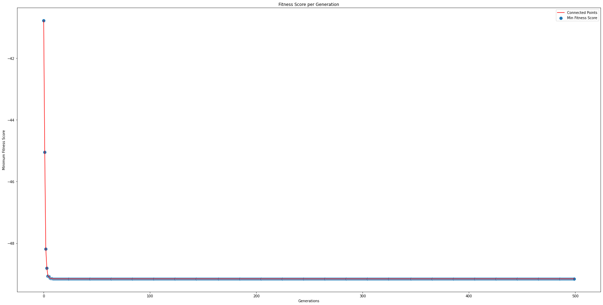

# Portfolio Optimization with Differential Evolution Approach-2

This is an implementation of portfolio optimization with differential evolution based on a different paper. 

Reference: https://ethz.ch/content/dam/ethz/special-interest/mtec/chair-of-entrepreneurial-risks-dam/documents/dissertation/master%20thesis/RoudierMScThesis.pdf

</img>
